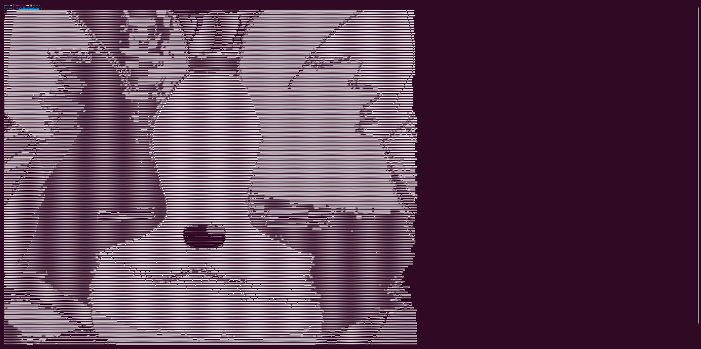

# 🩰 ascii



Convert images and videos to ascii.

## 🥌 Usage

| Args | Description                         | Default         |
| ---- | ----------------------------------- | --------------- |
| -i   | Input file                          |                 |
| -w   | Ascii width                         | Terminal width  |
| -h   | Ascii height                        | Terminal height |
| -a   | Aspect Ratio (s/square, p/portrait) | default         |

```sh
ascii -i <INPUT> [-w <WIDTH>] [-h <HEIGHT>] [-a <square | portrait>]
```

### 🧩 Supported formats

| Image          | Video    |
| -------------- | -------- |
| png, jpg, jpeg | mp4, gif |

### 🎥 Play video

When converting videos, an `.ascii` text file is generated. To play the video, run that generated file:

```
ascii -i path/to/file.ascii
```